# Pawgress

**The productivity companion that gets to know you.**

A conversational, AI-first productivity app: talk or type a natural,
unstructured brain-dump, and watch it become organized tasks — no setup,
no categories to configure first, no system to maintain. Built around a
single, deliberate bet: most productivity tools fail not from lacking
features, but because they punish inconsistency until people abandon
them. Pawgress never does — there is no streak counter, no red overdue
badge, and no "you missed a day" copy anywhere in the app.

🔗 **[Live demo](https://pawgress-tz7o.onrender.com)** — *(free-tier
hosting: the first request after a period of inactivity may take
30–60s to wake the server back up)*

---

## Capture: type it, or say it

The core interaction. A messy paragraph — several unrelated things at
once, no formatting, no punctuation to speak of — goes in as free text
or as a recorded voice note, and comes back out as clean, individually
editable tasks with a category, priority, and time estimate.

**Typing it:**

| Before | After |
|---|---|
| 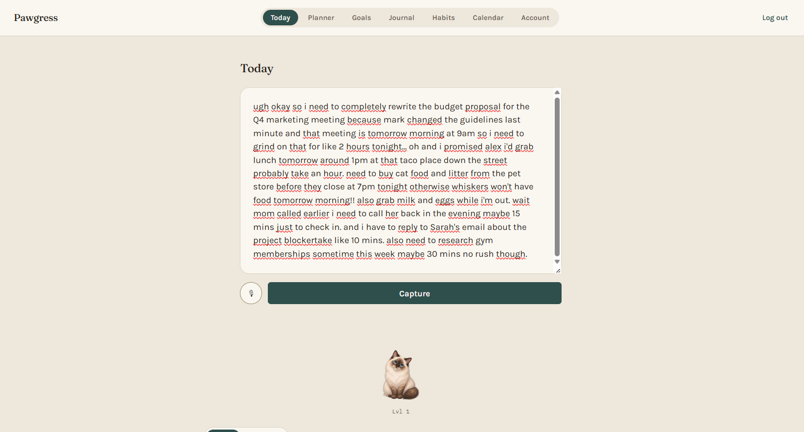 | 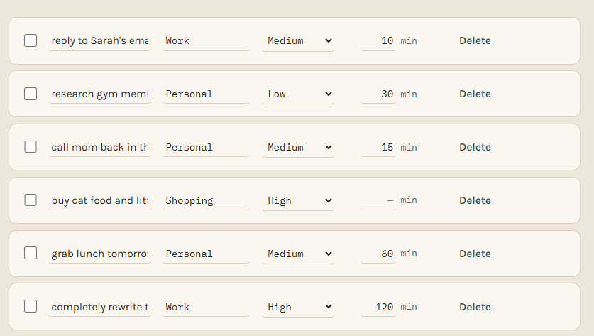 |

**Saying it instead** — the same capture box, a mic tap away. The
recording gets transcribed and dropped back into the *same* text box for
you to check before it's ever submitted — a misheard word is exactly as
cheap to fix as a typo, never silently trusted:

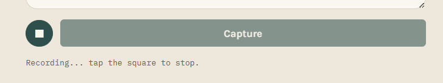

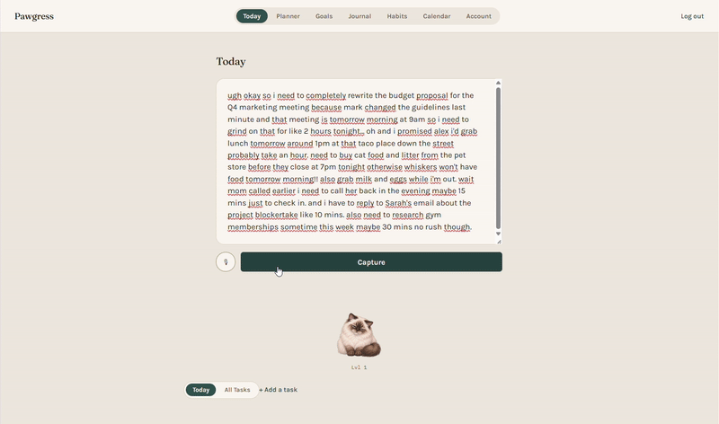

---

## Everything else, at a glance

| | |
|---|---|
| 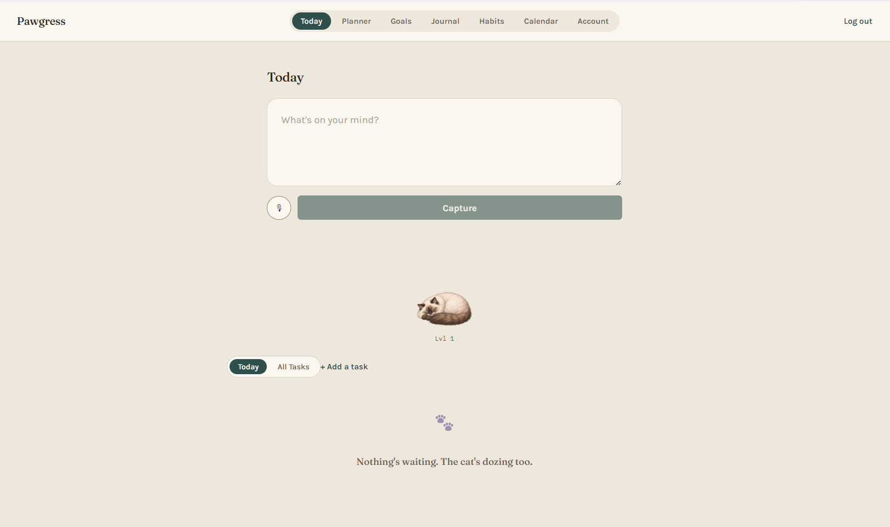 | **Nothing waiting?** The empty state is as calm as every other state — a sleeping cat, a quiet line of text, never a nagging "you have no tasks!" prompt. |
| 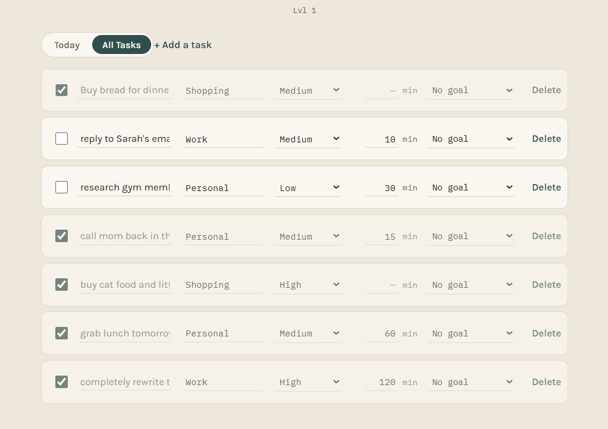 | **Tasks** — a flat, fast list. Every AI-assigned field (category, priority, estimate) is editable in place, no confirmation dialog. |
| 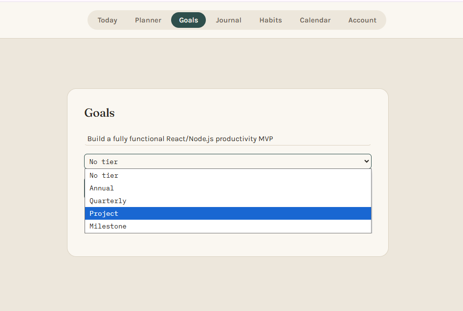 | **Goals** — an optional hierarchy (Annual → Quarterly → Project → Milestone) you build out only as far as you actually need; most tasks stay untiered indefinitely, and that's fine. |
| 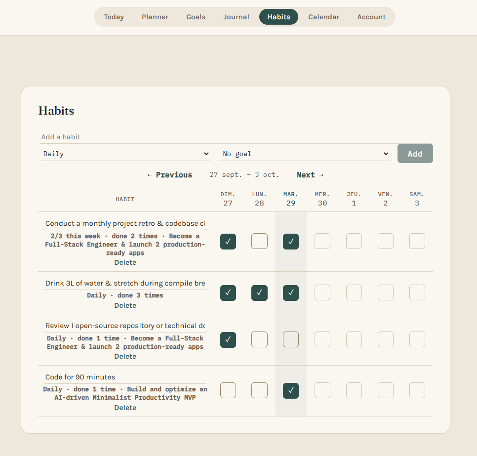 | **Habits** — a plain weekly checklist, not a streak counter. A blank cell is just a blank cell. |
| 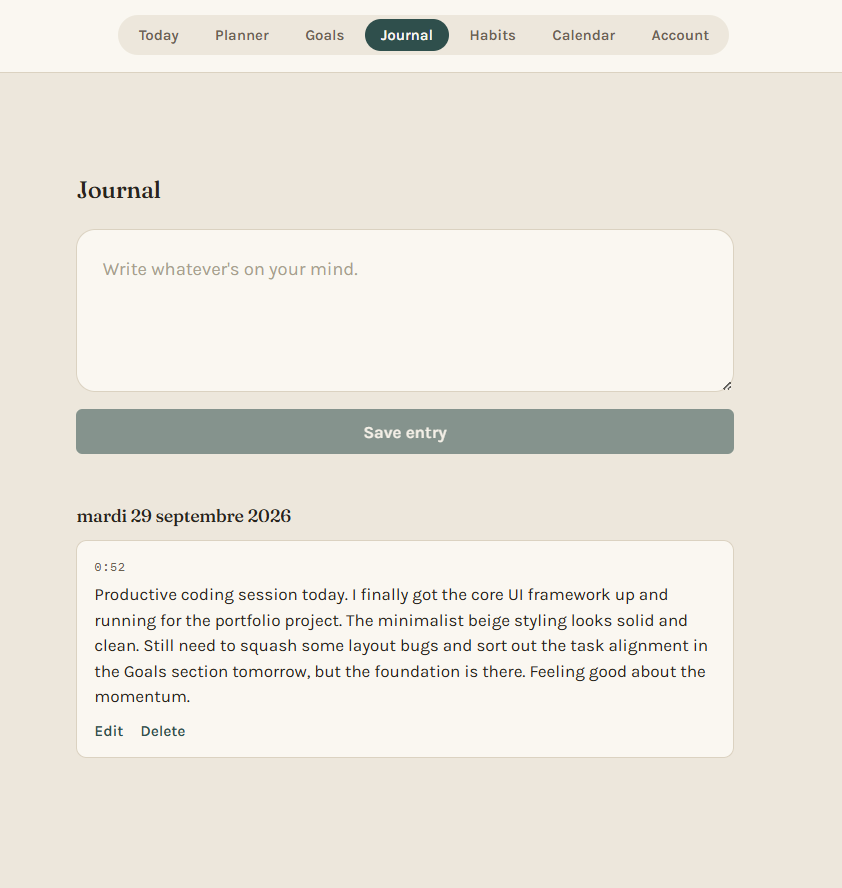 | **Journal** — entries grouped by day, so it stays readable as it grows instead of turning into one long scroll. |
| 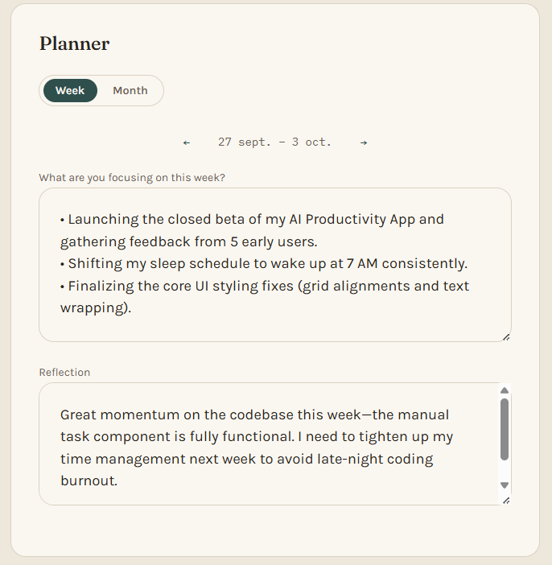 | **Weekly Planner** — a plain-language intention for the week, and a reflection whenever you get to it. No AI involved — just your own words. |
| 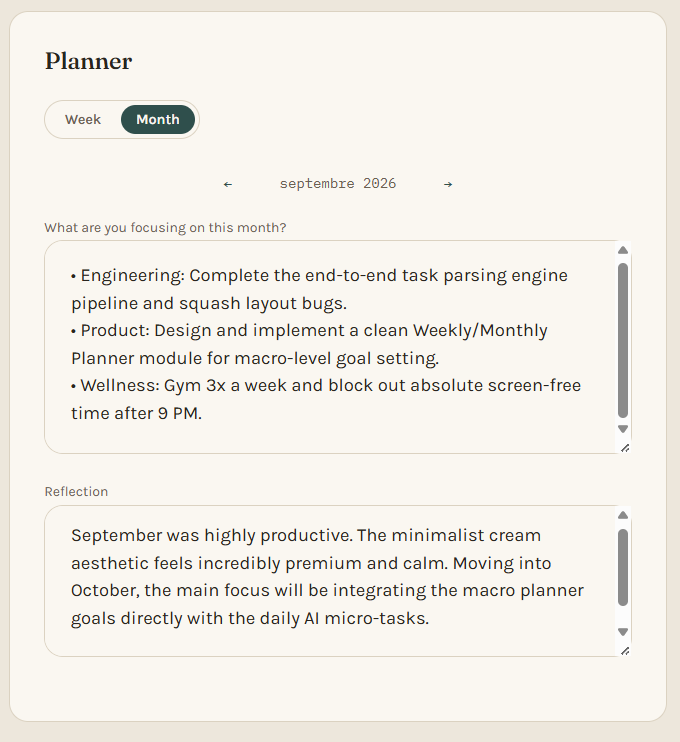 | **Monthly Planner** — the same idea, zoomed out to a month. |
| 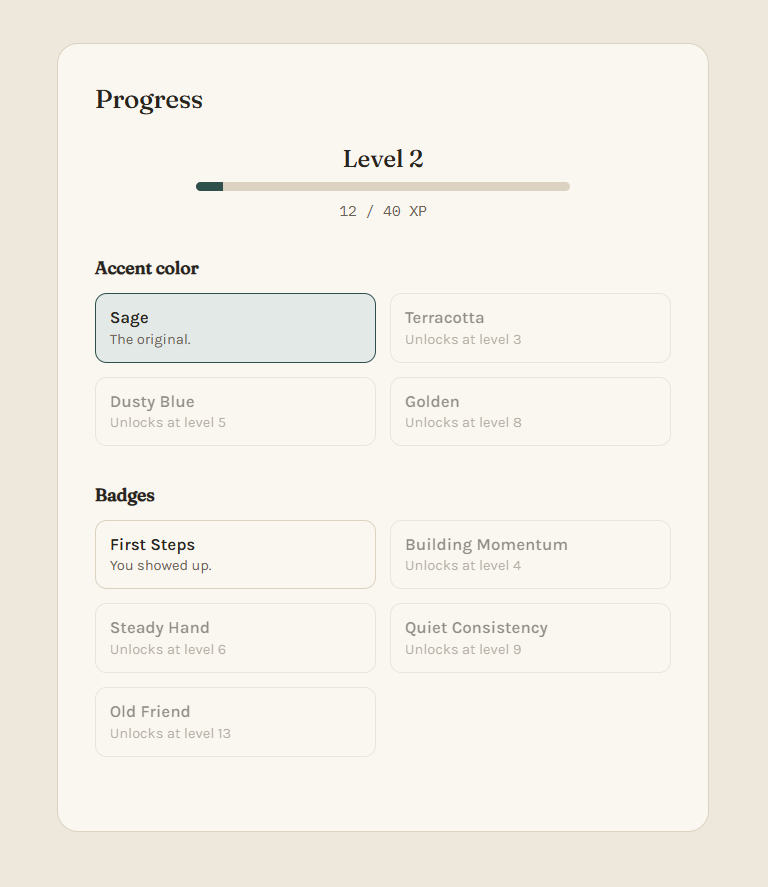 | **Progress** — XP and cosmetic unlockables (accent colors, badges) computed live from real completions. No spendable currency, no scarcity, nothing here ever goes down. |
| 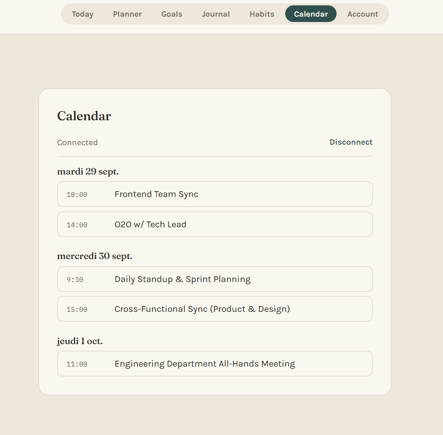 | **Calendar** — a read-only Google Calendar connection. |
| 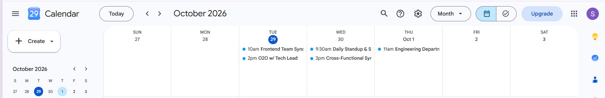 | *(...and the same events, live in Google Calendar, for comparison.)* |

---

## Tech stack

**Backend:** FastAPI, SQLAlchemy, Alembic, PostgreSQL ([Neon](https://neon.tech)), JWT auth, Groq (LLM extraction + Whisper transcription)
**Frontend:** React, TypeScript, Vite, TanStack Query
**Deployment:** Render — a single web service; FastAPI serves the built
React static files directly, so there's one process and one origin in
production (no CORS between frontend and backend, one OAuth redirect URI
to manage).

## Architecture notes

Backend is organized as a modular monolith — separate modules for
Identity, Productivity Core (Tasks/Goals/Captures), Companion, Habits,
Journal, Calendar, Planner, and Gamification, communicating through
explicit interfaces rather than reaching into each other's tables
directly. Chosen deliberately over microservices: this is a solo project
at a scale where that overhead buys nothing, with module boundaries
clean enough that splitting any one of them into its own service later
would be a straightforward extraction, not a rewrite.

Gamification and the companion's mood state are both computed live from
existing completion history rather than stored as their own counters —
one fewer thing that can drift out of sync with reality.

## Known limitations

- Google Calendar sync requires the connecting Google account to be
  added as an approved test user in Google Cloud Console — the OAuth
  consent screen hasn't gone through Google's full public-verification
  process, since this is a portfolio project rather than a production
  service handling third-party user data at scale.
- Email delivery for password reset is not yet wired to a real provider
  in this deployment.

## Running locally

```bash
# Backend
cd pawgress-backend
python -m venv venv
source venv/bin/activate  # Windows: venv\Scripts\Activate.ps1
pip install -r requirements.txt
cp .env.example .env  # fill in DATABASE_URL, JWT_SECRET, GROQ_API_KEY
alembic upgrade head
uvicorn main:app --reload

# Frontend, in a separate terminal
cd pawgress-frontend
npm install
cp .env.example .env
npm run dev
```

## Running tests

```bash
cd pawgress-backend && pytest
cd pawgress-frontend && npm test
```
